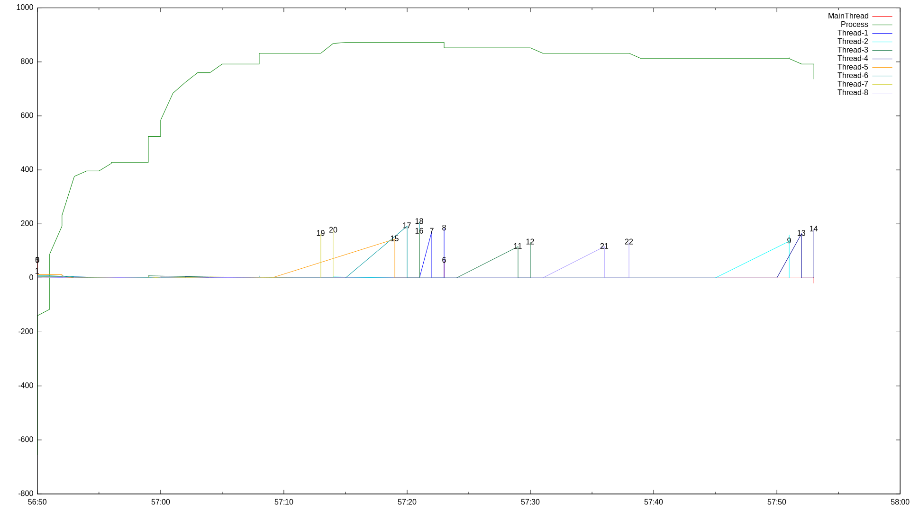

ThreadGraph memory profiler
===========================
ThreadGraph is a Python memory profiler for multi-threaded applications.

It is a two parts project: the first part is a module to include in the project
being profiled and the second is a command line tool to process the data
generate by the process.

Requirements
------------
The profiling module has the following requirements:

  * Python 2.6 or later (tested with 2.6, 2.7, 3.4rc1)
  * Pympler

While the processing module has the following:

  * Python 2.7 or later (it uses argparse)
  * gnuplot

Tutorial
========
This sections goes through the process of profiling a threading based
application.

This tutorial uses the code in examples/main.py as the profiled application
so you might want to read it quickly.
It is a simple application that creates some threads, each of which sleeps
and allocates memory.

Enabling the profiler
---------------------
The first step is to include and enable the memory profiler.
The only portion of code that needs to be changed in the profiled program is
the main function, so here is main:

    def main():
        threads = [DummyThread() for _ in xrange(THREAD_COUNT)]
        [t.start() for t in threads]
        [t.join()  for t in threads]

    if __name__ == "__main__":
        main()

To start collecting data change main to this:

    from thread_graph.Profiler import ProcessProfile

    def main():
        profiler = ProcessProfile(default_log_path="/data/profiling/example", profile="python")
        #profiler.setFilter("/path/to/code")
        #profiler.enableForkedProfile()
        profiler.trackStack()
        profiler.setProcessMemoryFrequence(20)
        profiler.enable()
        threads = [DummyThread() for _ in xrange(THREAD_COUNT)]
        [t.start() for t in threads]
        [t.join()  for t in threads]

First of all this will save profile data into "/path/to/profile/data/$pid"
Next there are some common, important, options:

  * **profile**: the profile keyword argument indicates the type of events to
                 profile, valid options are "python", "c" or "both" (default).
  * **setFilter**: this method sets the prefix filter applied to each event.
                   The argument is the absolute path/file containing the code
                   to profile.
  * **enableForkedProfile**: if your process creates subprocesses (forks in
                             Unix terminology) and you wish to profile the
                             subprocesses as well, this option allows exactly that.
  * **trackStack**: produce stack trace information along side memory information.
  * **enable**: start profiling the system.

These are the options that are used in this tutorial and should be the most used.
The full documentation is stored as Python documentation strings and is extracted
into the _docs_ directory by _pydoc_.

Once your process is set up to enable the profiler you can start it as you
normally would and it is now time to collect information.
If you have a particular task to profile go on and perform it as you normally
would (but with a little more patient).
Otherwise, if you do not have a specific task in mind and are just curious to
see how and what your program is doing simply go nuts!

If you are running the example program run

    python main.py

### A problem with performance
Although it is technically possible to profile every event in your program
regardless of source or type of event, it is an highly discouraged approach.
Everything means that builtin C functions and standard python modules are
profiled as well.
This leads to a complete image of your process but at the cost of an un-usably
slow process and enormous dump files.

Processing the dumps
--------------------
You run your program with the profiler enabled and collect gigs of data.
Finally you can figure out what is going on, but how?!?

While the profiler runs it outputs data into files for later processing.
The first thing to understand is the structure of these files.
In the set up you specified a base path to use ("/path/to/profile/data").
Every time you run the process it will create a directory in that path
named after the process id of the running instance.
Inside that directory files, usually one or more per thread, are created.

The result looks something like this:
    /path/to/profile/data/
        6685/
            Thread-4.mem
            Thread-5.stack
            Thread-5.mem
            Thread-8.mem
            Thread-4.stack
            Thread-8.stack
            process.mem
            Thread-2.mem
            Thread-3.stack
            Thread-7.stack
            Thread-6.stack
            Thread-6.mem
            Thread-1.stack
            MainThread.stack
            Thread-3.mem
            MainThread.mem
            Thread-1.mem
            Thread-7.mem
            Thread-2.stack

The _process.mem_ file stores a process level, timestamped, memory trace.
Than for each thread a memory dump file and a stack trace file (if enabled)
are created.
Those files can be processed with the ProfilerGraph command line utility
to extract information and produce memory usage graphs.

### Peaks
You should probably start by looking for memory spikes since they are
easy to find quickly.
This is because the ProfilerGraph has a command to find them for you:

    python ProfilerGraph.py memg --process_rebase=5500 --peak=20 --peak_delta_time=0 --peak_delta_value=50 /data/profiling/example/6685/*.mem

The command line options are explained in

    python ProfilerGraph.py memg --help

But here is a short idea:

    * process_rebase: decrease the process level absolute memory
      usage by the given value.
    * peak: defines what is considered a peak, in KB.
    * peak_delta_time: how many seconds need to pass between peaks
      before they can be marked again in the graph.
    * peak_delta_value: similar to peak_delta_time, but based on
      the value of the memory peak rather than time.

The above command produces an output similar to the following to
stdout and the _memg.svg_ and _memg.txt_ files.

    Processing data for thread CP Server Thread-5
    ...
    Processing data for thread MainThread
    Processing data for the process
    Running gnuplot.

This command produces a memory graph (memg) that shows the amount of
memory allocated by each thread, compared to the process level memory usage.

This is an example of graph produced by the command above:

There is a lot to talk about here but the core bits are:

    * Axis: the x-axis is the time stamp of the event while the y-axis is
      a memory size in kilobytes.

    * Legend: each line is associated to a thread except one that is
      associated to the process. In applications with many threads gnuplot
      will run out of colours and make it almost impossible to figure out
      which line is which thread but it will still provide an idea.
      To find out the exact mapping you can use the legend file associated
      to the graph that will be discussed later.

    * The threads memory: shows memory allocations, computed as the difference
      in memory allocated before and after a function call.

    * The process memory: Is the absolute value of the resident set size for
      the entire process.
      The process memory is going to be drastically higher than any other
      measurement since it is an absolute memory value.
      To prevent thread data to be squashed too much, the absolute memory size
      of the process can be rebased (the default rebase is Memory - 30MB).

    * Peaks: these are the interesting bits.
      The definition of peak can be specified in the command line so do not
      worry if they are wrong for you.
      Each peak is also labelled with an integer that identifies the detailed
      function return event that justifies that peak.
      The identifiers can be resolved using the legend file.

The legend file is a text file that maps the label integers to a string
with this format: _thread name>file:line:name=>memory delta_.
The part after the _>_ is a line you can find in the memory dump file and
is composed by the absolute path to the file containing the function that
is about to return (through a return statement or an exception), the line
at which the return statement is found, the name of the function itself and
finally the memory delta between the beginning of the call and now.

For example point 18 in the demo data has this line in the memg.txt

    18: Thread-6>main.py:44:run=>212992

This means that, at some point of execution in Thread-6, a return from
_run_, in main.py at line 44, left 212992 Bytes of memory in the process.

### Stacks
If functions that cause peaks are enough for you this section will be a
treat, otherwise you will need it to find out what is going on by
looking at stack traces.

In order to use stack trace information timestamps (enabled by default)
and stack profiling (disabled by default) must be enabled.
The example set up above enables these requirements.

This tutorial uses a particular run of the demo application but not all
dump files are provided (only the results are).
What we show here ma not be what you see and that is expected.

We now look at the peak marked 19 in the graph and find the following
line in memg.txt:

    19: Thread-7>main.py:39:doStuff=>167936

From this we want to go back to the exact line in the memory profile
for the thread and we use grep to do it:

    grep -n "main.py:39:doStuff=>167936" /data/profiling/example/6685/Thread-7.mem

    > 30:1394031433.4#main.py:39:doStuff=>167936

At line 30 of the memory dump we have an event in the format
_Unix time#file:line:function=>memory_.

What we can do with that is find the stack trace from there down and decorate
it with time and memory information.
ProfilerGraph.py has the _decorate-stack_ command to do it:

    python ProfilerGraph.py decorate-stack --prefix=/data/code/thread_graph/examples/ /data/profiling/example/6817/Thread-7.mem data/profiling/example/6817/Thread7.stack 30 > examples/trace.tx

    > Scanning memory file looking for the event.
    > Scanning stack file looking for a matching event.
    > Reversing memory events of interest.
    > Parsing stack trace into a tree.
    > Reconciling trace and memory.
    > Decorating trace.

This command outputs status information to stderr and results to stdout.
You probably want to redirect the results to file more often than not because
navigation can get trick if you are not in an editor.

But before we look at the result, here is an explanation of the command:

    * prefix: strip the given prefix from file names that start with it.
    * Path to the memory dump.
    * Path to the stack trace dump.
    * A "memory event": this can be the line number extracted from the memory
      file (as done above) or the line from the memory file itself.

And now for the output:

    doStuff@main.py:27-39, Time: 22.0300002098 s, Memory: 167936 B
     randint@/home/stefano/pys/py27/lib/python2.7/random.py:236-240, Time: 0.0 s, Memory: 0 B
      randrange@/home/stefano/pys/py27/lib/python2.7/random.py:173-214, Time: 0.0 s, Memory: 0 B
     randint@/home/stefano/pys/py27/lib/python2.7/random.py:236-240, Time: 0.0 s, Memory: 4096 B
      randrange@/home/stefano/pys/py27/lib/python2.7/random.py:173-214, Time: 0.0 s, Memory: 0 B
     randint@/home/stefano/pys/py27/lib/python2.7/random.py:236-240, Time: 0.0 s, Memory: 0 B
      randrange@/home/stefano/pys/py27/lib/python2.7/random.py:173-214, Time: 0.0 s, Memory: 0 B
     randint@/home/stefano/pys/py27/lib/python2.7/random.py:236-240, Time: 0.0 s, Memory: 4096 B
      randrange@/home/stefano/pys/py27/lib/python2.7/random.py:173-214, Time: 0.0 s, Memory: 0 B
     randint@/home/stefano/pys/py27/lib/python2.7/random.py:236-240, Time: 0.0 s, Memory: 0 B
      randrange@/home/stefano/pys/py27/lib/python2.7/random.py:173-214, Time: 0.0 s, Memory: 0 B
     randint@/home/stefano/pys/py27/lib/python2.7/random.py:236-240, Time: 0.0 s, Memory: 4096 B
      randrange@/home/stefano/pys/py27/lib/python2.7/random.py:173-214, Time: 0.0 s, Memory: 0 B
     randint@/home/stefano/pys/py27/lib/python2.7/random.py:236-240, Time: 0.0 s, Memory: 0 B
      randrange@/home/stefano/pys/py27/lib/python2.7/random.py:173-214, Time: 0.0 s, Memory: 0 B
     randint@/home/stefano/pys/py27/lib/python2.7/random.py:236-240, Time: 0.0 s, Memory: 4096 B
      randrange@/home/stefano/pys/py27/lib/python2.7/random.py:173-214, Time: 0.0 s, Memory: 0 B
     randint@/home/stefano/pys/py27/lib/python2.7/random.py:236-240, Time: 0.0 s, Memory: 0 B
      randrange@/home/stefano/pys/py27/lib/python2.7/random.py:173-214, Time: 0.0 s, Memory: 0 B
     randint@/home/stefano/pys/py27/lib/python2.7/random.py:236-240, Time: 0.0 s, Memory: 0 B
      randrange@/home/stefano/pys/py27/lib/python2.7/random.py:173-214, Time: 0.0 s, Memory: 0 B
     randint@/home/stefano/pys/py27/lib/python2.7/random.py:236-240, Time: 0.0 s, Memory: 0 B
      randrange@/home/stefano/pys/py27/lib/python2.7/random.py:173-214, Time: 0.0 s, Memory: 0 B
     randint@/home/stefano/pys/py27/lib/python2.7/random.py:236-240, Time: 0.0 s, Memory: 0 B
      randrange@/home/stefano/pys/py27/lib/python2.7/random.py:173-214, Time: 0.0 s, Memory: 0 B
     randint@/home/stefano/pys/py27/lib/python2.7/random.py:236-240, Time: 0.0 s, Memory: 0 B
      randrange@/home/stefano/pys/py27/lib/python2.7/random.py:173-214, Time: 0.0 s, Memory: 0 B

Our _doStuff_ method call _randint_, which in turn calls _randrange_.
But we can see that calls to _randint_ and _randrange_ do not allocate much memory
so the majority of the 164 KB must come from the _doStuff_ function itself.

We skipped over the 4KB allocations in _randint_ because they are most likely
imprecisions due to Linux memory overcommit and allocate on write (see kernel
zero page) strategies.
The next session discusses the problem of imprecisions with focus on a
much more common situation and the solution implemented in ThreadGraph.

Threads, sleeps and shared memory
---------------------------------
Threads are concurrent units of execution within the same process (not an
official definition) and that share the same memory address space.

Since they share the same memory there is a problem: given the amount of memory
currently in use for the process how to determine how much was allocated
by each thread?

ThreadGraph looks at the current memory usage before the start and after the
end of each (traced) function, somewhat assuming that context switches do not
happen often.

Since this is obviously not true we need a way to identify (or attempt to
identify) context switches and subtract the amount of memory allocated by
other threads.

This is achieved by monitoring functions that are likely (or guaranteed)
to cause a context switch and for each thread keep track of how much memory
was allocated while the thread was not running.
The total memory that a thread sees is corrected with that estimate.
The functions that are currently tracked for this purposes are thread _sleep_
and locks __acquire__.

This estimation approach can be disabled by calling

    profiler.trackSleeps(False)

during set up.
